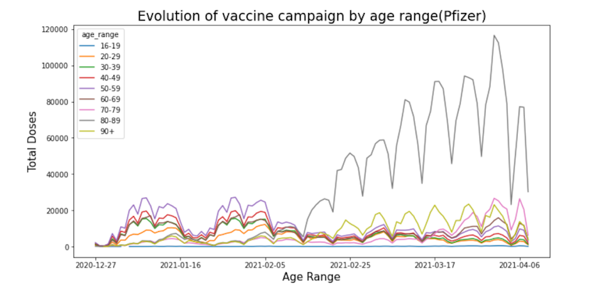
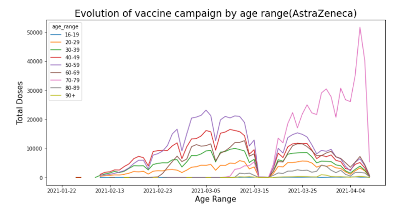
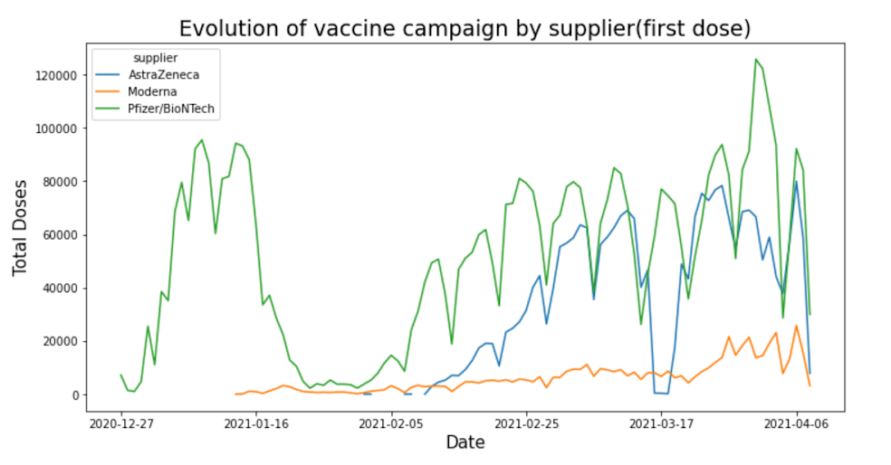
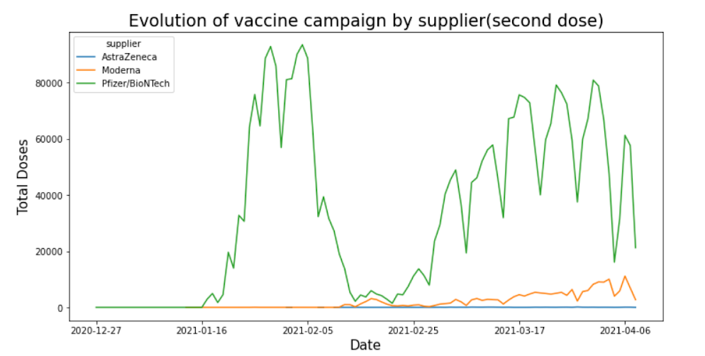

Italy Vaccination Campaign
================
Table of Content
================
  * [Description](#description)
  * [Files](#files)
  * [Process](#process)
  * [Results](#results)
  * [Installation guide](#installation-guide)
  * [Credits](#credits)
  * [Licensing](#licensing)

## Description
This is an analysis of the vaccination campaign against covid-19 in Italy that began in 2020, it is using three different types of vaccines, which need two doses to be effective, also have different times between the first dose and the second, likewise, their availability and quantities are different.
The age groups are eight, the first is made up of young people between 16 and 19 years old, the following groups are for ten years up to 89 years and the last one is ninety or more years.

## Files
  
## Process

## Results
The graphs presented were divided into the first three by the types of vaccines and the following will be comparative in the doses.

- the italian government started the vaccination campaign with Pfizer in December without major differences in age groups. In February, it prioritized the group from 80 to 89 years old with a clear difference. In the evaluated period and without making a difference between the first and second doses, the total of the pfizer vaccine reached a peak of 120,000 doses in one day.

- The italian government began AstraZeneca campaign with very few doses in January and in February, with greater availability, a prioritization of four groups of people began between 20 and 29 years old, between 30 and 39 years old, between 40 and 49 years old, and finally between 50 and 59 years old, until the middle of March, then it prioritized the group of 70 to 79 years. In the evaluated period and without making a difference between the first and second doses, the total of the AstraZeneca vaccine reached a peak of about 50,000 doses in one day.

- the government began Moderna AstraZeneca in January with few doses, since February they prioritized the group of 80 to 89 years and in the middle of March also prioritize the group of 70 to 79 years. In the evaluated period and without making a difference between the first and second doses, the total of the Modern vaccine reaching a peak of about 14,000 doses in one day, this is the vaccine with the least availability and therefore the least application within the population.

## Installation guide

If you use conda, you can install: 

   * conda install pandas
   * conda install seaborn
   * conda install numpy

If you use pip, you can install: 

   * pip install pandas
   * pip install seaborn

## Credits
The analysis of the dataset was carried out by Eliseo B.
the file is in jupiternotebook format ".pynb"

## Licensing
 MIT License, Eliseo Baquero 2021
   * pip install numpy
